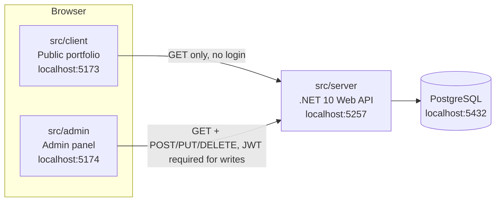

# CareerOS — Project Overview

This document explains what's been built so far, why it's built this way,
and how to run it — written for someone with general programming knowledge
but zero context on this specific project. If a term is unfamiliar, check
the [Glossary](#9-glossary) at the bottom.

---

## 1. What this project is

CareerOS is a personal portfolio site (`src/client`) whose content —
profile, work experience, projects, skills, certifications, education —
lives in a real database and is fully editable through a private admin
panel (`src/admin`), rather than being hardcoded into the website. Both
apps talk to one API (`src/server`). This is Phase 1 ("Foundation") of a
larger roadmap described in the repo's root `README.md`.

---

## 2. The three apps and how they talk to each other



- **`src/client`** — the public website. Anonymous, read-only. Fetches
  everything via plain `GET` requests and renders it.
- **`src/admin`** — the private control panel. Requires login. Can read
  *and* write every resource.
- **`src/server`** — the one API both apps call. It's the only thing that
  talks to the database directly.
- **PostgreSQL** — one database, one source of truth, shared by both apps
  through the API (neither app ever touches the database directly).

Each piece runs on its own port, and that stays true whether you start
them via the VS Code tasks or inside Docker containers (see
[Docker-Guide.md](Docker-Guide.md)) — same ports either way.

---

## 3. Backend architecture, explained not just described

The API code is organized in three layers, and every resource (Profile,
Experience, Projects, Skills, Certifications, Education) follows the exact
same shape. Take `ExperienceEntry` as the running example:

```
Controller  →  Service  →  Repository  →  Database
(HTTP layer)   (business    (data access)
                logic)
```

- **`Controllers/ExperienceController.cs`** — the only layer that knows
  about HTTP. It receives the request, calls the service, and returns a
  status code. It has *zero* knowledge of how data is stored.
- **`Services/ExperienceService.cs`** (behind `IExperienceService`) — the
  business-logic layer. Today it's mostly a thin pass-through to the
  repository, but this is deliberately where logic like validation,
  combining multiple repositories, or caching would go later — see
  `CredentialsService.cs` for a real example already doing this (it calls
  *two* repository methods — certifications and education — and combines
  them into one response for the controller).
- **`Repositories/IExperienceRepository.cs`** (interface) with
  **`Repositories/EfCore/EfCoreExperienceRepository.cs`** (the real
  implementation) — the only layer that knows about the database. It reads
  and writes `Data/Entities/ExperienceEntryEntity.cs` rows via Entity
  Framework Core and maps them to/from the public `Models/ExperienceEntry.cs`
  shape using `Data/Mapping/EntityMappingExtensions.cs`.

**Why three layers instead of the controller just querying the database
directly?** Two concrete reasons, not theoretical ones:

1. **It was already proven to matter.** Every repository interface also has
   an `InMemory` implementation (`Repositories/InMemory/`) — hardcoded C#
   data, no database at all. That's literally how this project started:
   the whole API ran on in-memory fake data before Postgres existed. When
   the real database was added, only the repository layer changed (new
   `EfCore*` classes, one line each in `Extensions/ServiceCollectionExtensions.cs`
   swapping which implementation gets used) — the services, controllers,
   and every API response shape were untouched. That's the entire point of
   depending on `IExperienceRepository` (an interface) instead of a
   concrete class.
2. **Testability.** The `InMemory` implementations still exist today,
   unused in normal running but ready for fast unit tests that don't need
   a real database.

**Where SOLID shows up concretely, not abstractly:**
- *Interface segregation*: there's an `IExperienceRepository`, a separate
  `IProjectRepository`, a separate `ISkillRepository` — not one giant
  `IRepository` interface every resource is forced to implement pieces of.
- *Dependency inversion*: `ExperienceController` depends on
  `IExperienceService` (an interface), never on the concrete
  `ExperienceService` class. `ExperienceService` depends on
  `IExperienceRepository`, never on `EfCoreExperienceRepository` directly.
  Swapping implementations never requires touching the classes that depend
  on the interface.

**Public API contract vs. database schema are deliberately different
things.** `Models/ExperienceEntry.cs` (what the API returns as JSON) and
`Data/Entities/ExperienceEntryEntity.cs` (what's actually stored in
Postgres) are two separate classes, not one reused for both. The entity has
a `SortOrder` column the public API doesn't expose the same way, and uses
`List<string>` where the model uses `IReadOnlyList<string>`. This means the
database schema can evolve without automatically changing what the public
website receives, and vice versa.

**Read vs. write shapes are also separate.** `Models/ExperienceEntry.cs`
(returned by `GET`) and `Models/Requests/ExperienceEntryRequest.cs` (sent
to `POST`/`PUT`) are different classes too — the request type has no `Id`
field (the ID comes from the URL on updates, or is generated server-side on
creates) and carries `[Required]` validation attributes that automatically
produce a 400 response if a client sends an incomplete payload.

---

## 4. Database

**PostgreSQL 16 with the pgvector extension**, chosen for one forward-looking
reason: Phase 4 of the roadmap adds AI-powered search over career-diary
entries, which needs vector embeddings. Picking a database that already
supports vectors natively (via the `pgvector` extension) means that phase
won't require migrating to a different database later — it can just add
new columns.

**Entity Framework Core** is the .NET library that maps C# classes
(`Data/Entities/*.cs`) to database tables. **Migrations** are EF Core's
versioned, incremental description of schema changes — each one is a C#
file under `src/server/Migrations/` that knows how to both apply and
reverse a specific set of table changes. `Program.cs` calls
`db.Database.MigrateAsync()` on every startup, so any migration that hasn't
been applied yet gets applied automatically — safe to run repeatedly,
since already-applied migrations are simply skipped (tracked in a
`__EFMigrationsHistory` table Postgres itself stores).

**Seed data**: `Data/Seed/PortfolioDataSeeder.cs` inserts the original
resume content (profile, experience, projects, etc.) the first time the
app runs against an empty database — checked via "does the `Profiles` table
already have a row?" so it never duplicates data on subsequent restarts.
`Data/Seed/IdentityDataSeeder.cs` does the same for the one admin login
account.

---

## 5. Authentication, explained simply

A **JWT** (JSON Web Token) is a signed, inspectable piece of text — think
of it like a wax-sealed letter: anyone who has it can *read* what's
written inside (it's not encrypted, just encoded), but only the server
(which holds the secret signing key) can verify the seal wasn't tampered
with. When you log in, `Controllers/AuthController.cs` checks your
password, then `Services/Auth/JwtTokenService.cs` issues one of these
tokens containing your user ID and email, signed with a secret key
(`Jwt:Key`, stored outside source control — see §8).

**Why the token can be sent two different ways:**
- The **`src/admin`** React app never touches the token in JavaScript at
  all — login sets it as an `httpOnly` cookie, which means client-side
  script literally cannot read it (`document.cookie` won't show it), so a
  bug elsewhere in the admin app's JS can't leak it.
- **Postman or any other API client** uses the classic
  `Authorization: Bearer <token>` header instead — the standard way to call
  an API directly (see `docs/Postman-Guide.md`).

Both paths are accepted by the same middleware
(`Extensions/AuthServiceCollectionExtensions.cs` — a custom
`OnMessageReceived` check falls back to the cookie only if no header is
present).

**Why there's exactly one login account and no "sign up" page**: nothing in
this project's roadmap has a public registration flow — it's a personal
admin tool, not a multi-user platform. `IdentityDataSeeder` creates the one
account from configuration on first run; there is no `/register` endpoint.

**Public reads stay public.** Every `GET` endpoint (what `src/client` uses)
has no `[Authorize]` attribute and needs no token at all. Only the
`POST`/`PUT`/`DELETE` actions (what `src/admin` uses) are protected — and
that's set per-*action*, not per-controller, so a controller can freely mix
public reads and protected writes (see any controller in `Controllers/`).

---

## 6. Frontend structure

**Why `src/client` and `src/admin` are two separate apps instead of one**:
this wasn't a stylistic preference — it was measured. The two apps use
different Bootstrap theme downloads (`public/theme/` in each), and their
`bootstrap.min.css`/`style.min.css` files are genuinely different builds
(different file sizes, different rule sets), not just re-skins of the same
one. Loading both in a single page risked silent class-name collisions
(e.g. `.btn-primary` resolving differently depending on which file loaded
last). Two independent apps, two independent Vite dev servers
(`localhost:5173` and `localhost:5174`), guarantees they never share a
page and never fight over the same CSS class.

Both apps follow the same internal shape:
- **`api/`** — typed `fetch` wrapper functions, one file per concern
  (`client.ts` for the low-level request logic, `portfolioApi.ts` for the
  actual endpoints, `authApi.ts` in admin only).
- **`components/`** — reusable UI pieces. `src/client/components/sections/`
  holds the portfolio's page sections (Hero, About, Experience, …);
  `src/admin/components/crud/` holds the generic, resource-agnostic
  `CrudTable`/`CrudForm`/`ArrayField` components every admin page is built
  from, so adding CRUD for a new resource later doesn't mean writing a new
  table/form from scratch.
- **`pages/`** (admin only — the public client is a single-page,
  anchor-scroll layout with no routing) — one file per route, thin
  wrappers around the generic CRUD components plus that resource's field
  schema.
- **`types/`** — TypeScript interfaces mirroring the API's C#
  `Models`/`Models/Requests` shapes exactly, so a change to the API
  contract is a compile error in the frontend if the type isn't updated to
  match.

---

## 7. Where everything lives

```
src/
  server/                      .NET 10 Web API
    Controllers/                HTTP layer — one file per resource
    Services/                   business logic layer
      Auth/                      JWT issuing
    Repositories/                data access layer
      EfCore/                     real (Postgres) implementations — in use
      InMemory/                   fake implementations — kept for tests
    Models/                      public API response shapes
      Auth/                       login request/response shapes
      Requests/                   public API write (POST/PUT) shapes
    Data/
      Entities/                   EF Core / database table shapes
      Mapping/                    Entity <-> Model conversion
      Seed/                       first-run data population
      CareerOSDbContext.cs        EF Core's database session class
    Migrations/                  EF Core's versioned schema history
    Extensions/                   DI registration + startup wiring, grouped by concern
    Program.cs                   application entry point / startup pipeline

  client/                       public portfolio (React, port 5173)
    src/api/, components/, hooks/, styles/, types/

  admin/                        admin panel (React, port 5174)
    src/api/, auth/, components/, pages/, styles/, types/

docker/                        docker-compose.yml (dev) and docker-compose.prod.yml,
                                 covering Postgres, the API, and both React apps
docs/                           Postman-Guide.md, this file, Docker-Guide.md
```

---

## 8. How to run it today

The fastest day-to-day loop is the VS Code tasks already set up
(`.vscode/tasks.json` / `.vscode/launch.json`):

- **`Run: Everything`** (Terminal → Run Task) starts the API, the public
  site, and the admin panel together.
- Or run them individually: **`server: watch`**, **`client: dev`**,
  **`admin: dev`**.
- Press **F5** and pick **"Full Stack + Admin: Debug"** to get breakpoints
  working in both the C# and the TypeScript code at once.

Local secrets (database connection string, JWT signing key, admin
email/password) live in **.NET User Secrets**, not in any committed file —
set once via `dotnet user-secrets set "Key" "Value"` inside `src/server`.

Once running:
- Public site: `http://localhost:5173`
- Admin panel: `http://localhost:5174` (log in with the seeded admin
  account)
- API + Swagger docs: `http://localhost:5257/swagger`

To call the API directly instead of through the admin UI (e.g. to script a
bulk edit), see **`docs/Postman-Guide.md`** — it covers getting a token and
calling every endpoint.

---

## 9. Glossary

- **Repository pattern** — an interface (e.g. `IExperienceRepository`) that
  hides *how* data is stored behind a simple contract (get, create, update,
  delete). Code that uses the repository doesn't know or care whether it's
  talking to Postgres, an in-memory list, or anything else.
- **Dependency injection (DI)** — instead of a class creating the objects
  it depends on, they're handed to it (usually via the constructor) by a
  central container that was told, once, which concrete class to use for
  each interface. `Extensions/ServiceCollectionExtensions.cs` is where
  those "use this concrete class for this interface" decisions live for
  this project.
- **Migration** — a versioned, incremental description of a database
  schema change, generated by EF Core, that can be applied (or reversed) in
  order. Lets the database schema evolve over time without hand-writing SQL.
- **JWT (JSON Web Token)** — a signed, self-contained token proving who a
  user is; see §5.
- **CORS (Cross-Origin Resource Sharing)** — a browser security rule that
  blocks a web page from calling an API on a different origin (domain
  *and* port) unless that API explicitly allows it.
  `Program.cs` explicitly allows `localhost:5173` and `localhost:5174` to
  call the API — everything else is blocked by the browser automatically.
- **DTO (Data Transfer Object)** — a plain class whose only job is
  carrying data across a boundary (like an HTTP request/response), as
  opposed to containing behavior. `Models/*.cs` and `Models/Requests/*.cs`
  are DTOs.
- **Middleware** — code that runs on every request as it passes through
  the API, in a defined order, before it reaches a controller (e.g.
  `app.UseAuthentication()`, `app.UseCors(...)` in `Program.cs`).
